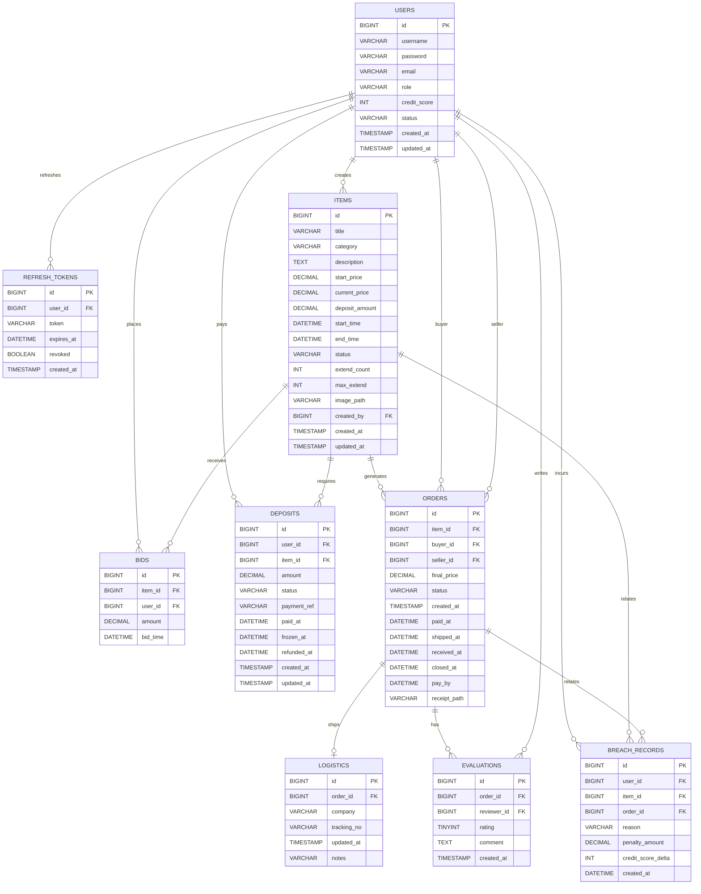

# 实体关系图 (E-R 图)

以下为根据 `schema.sql` 汇总的实体关系图，包含主要实体、属性与关系：

```mermaid
erDiagram
  USERS {
    BIGINT id PK
    VARCHAR username
    VARCHAR password
    VARCHAR email
    VARCHAR role
    INT credit_score
    VARCHAR status
    TIMESTAMP created_at
    TIMESTAMP updated_at
  }

  REFRESH_TOKENS {
    BIGINT id PK
    BIGINT user_id FK
    VARCHAR token
    DATETIME expires_at
    BOOLEAN revoked
    TIMESTAMP created_at
  }

  ITEMS {
    BIGINT id PK
    VARCHAR title
    VARCHAR category
    TEXT description
    DECIMAL start_price
    DECIMAL current_price
    DECIMAL deposit_amount
    DATETIME start_time
    DATETIME end_time
    VARCHAR status
    INT extend_count
    INT max_extend
    VARCHAR image_path
    BIGINT created_by FK
    TIMESTAMP created_at
    TIMESTAMP updated_at
  }

  BIDS {
    BIGINT id PK
    BIGINT item_id FK
    BIGINT user_id FK
    DECIMAL amount
    DATETIME bid_time
  }

  DEPOSITS {
    BIGINT id PK
    BIGINT user_id FK
    BIGINT item_id FK
    DECIMAL amount
    VARCHAR status
    VARCHAR payment_ref
    DATETIME paid_at
    DATETIME frozen_at
    DATETIME refunded_at
    TIMESTAMP created_at
    TIMESTAMP updated_at
  }

  ORDERS {
    BIGINT id PK
    BIGINT item_id FK
    BIGINT buyer_id FK
    BIGINT seller_id FK
    DECIMAL final_price
    VARCHAR status
    TIMESTAMP created_at
    DATETIME paid_at
    DATETIME shipped_at
    DATETIME received_at
    DATETIME closed_at
    DATETIME pay_by
    VARCHAR receipt_path
  }

  LOGISTICS {
    BIGINT id PK
    BIGINT order_id FK
    VARCHAR company
    VARCHAR tracking_no
    TIMESTAMP updated_at
    VARCHAR notes
  }

  EVALUATIONS {
    BIGINT id PK
    BIGINT order_id FK
    BIGINT reviewer_id FK
    TINYINT rating
    TEXT comment
    TIMESTAMP created_at
  }

  BREACH_RECORDS {
    BIGINT id PK
    BIGINT user_id FK
    BIGINT item_id FK
    BIGINT order_id FK
    VARCHAR reason
    DECIMAL penalty_amount
    INT credit_score_delta
    DATETIME created_at
  }

  USERS ||--o{ REFRESH_TOKENS : "refreshes"
  USERS ||--o{ ITEMS : "creates"
  USERS ||--o{ BIDS : "places"
  ITEMS ||--o{ BIDS : "receives"
  USERS ||--o{ DEPOSITS : "pays"
  ITEMS ||--o{ DEPOSITS : "requires"
  ITEMS ||--o{ ORDERS : "generates"
  USERS ||--o{ ORDERS : "buyer"
  USERS ||--o{ ORDERS : "seller"
  ORDERS ||--o| LOGISTICS : "ships"
  ORDERS ||--o{ EVALUATIONS : "has"
  USERS ||--o{ EVALUATIONS : "writes"
  USERS ||--o{ BREACH_RECORDS : "incurs"
  ITEMS ||--o{ BREACH_RECORDS : "relates"
  ORDERS ||--o{ BREACH_RECORDS : "relates"
```
