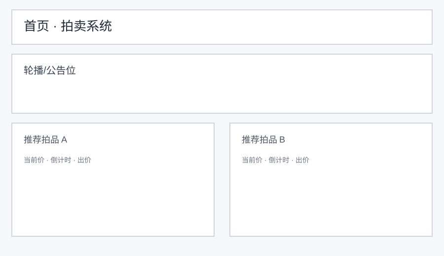
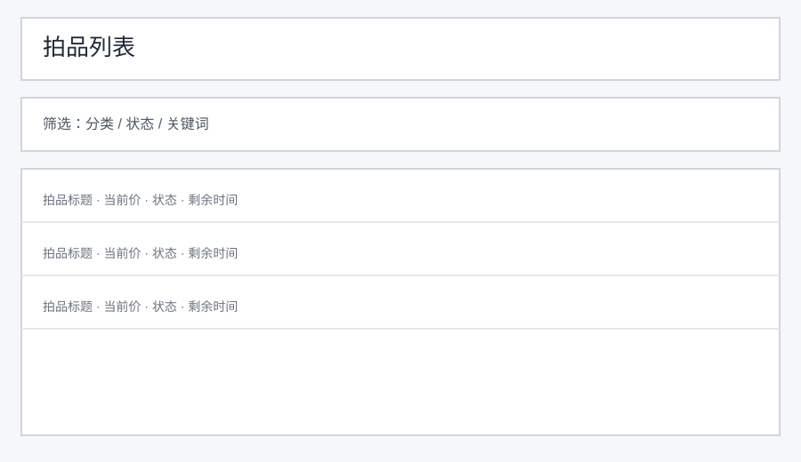
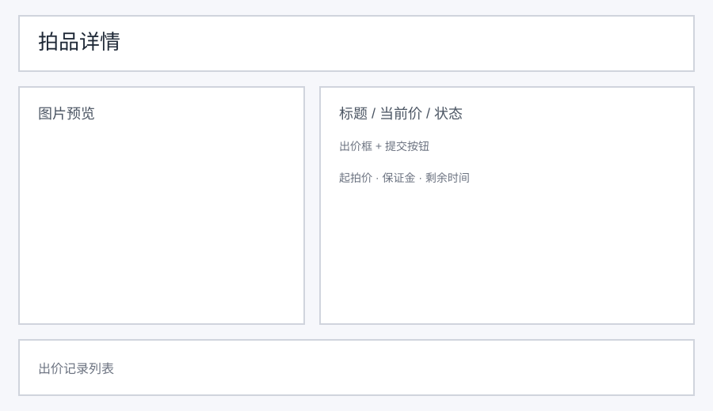
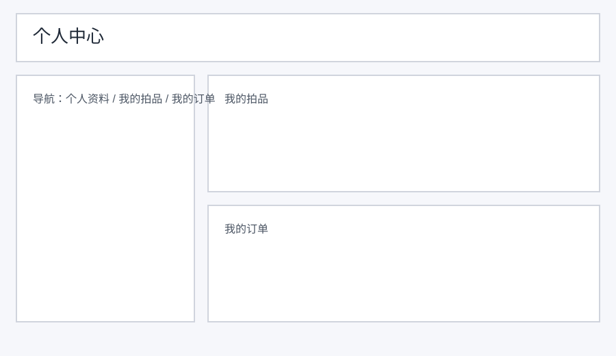
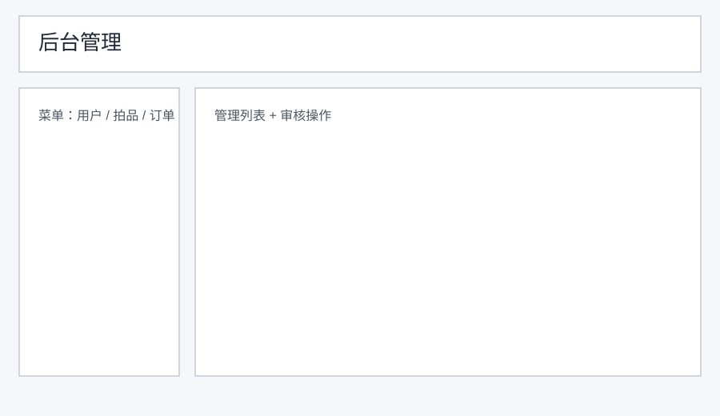

# 拍卖系统实现说明

## 1. 开发环境与工具

- **IDE**：IntelliJ IDEA（后端开发）、VS Code（前端/文档编辑）
- **数据库与缓存工具**：MySQL Workbench / DataGrip（数据库管理）、RedisInsight（Redis 可视化）
- **接口调试**：Swagger UI（后端已集成）、Postman / Apifox
- **构建与依赖管理**：Maven（Spring Boot）、Node.js + npm（前端构建）
- **版本控制**：Git + GitHub（PR/Issue 工作流）

## 2. 核心功能模块实现

### 2.1 用户模块实现（注册、登录、权限校验）

- **注册逻辑**：`AuthController#register` 调用 `UserServiceImpl#register`，先校验用户名/邮箱唯一性，再使用 BCrypt 加密密码并写入数据库。
- **登录逻辑**：`AuthController#login` 使用 Spring Security 的 `AuthenticationManager` 完成认证，生成 JWT + Refresh Token。
- **权限校验**：`SecurityConfig` 统一配置 JWT 过滤器与开放/受保护的 API 路径，实现对接口的访问控制。

代码示例（注册/登录）：

```java
// src/main/java/org/example/auction/controller/AuthController.java
@PostMapping("/login")
public ResponseEntity<?> login(@Valid @RequestBody LoginRequest req) {
    authenticationManager.authenticate(
        new UsernamePasswordAuthenticationToken(req.getUsername(), req.getPassword()));
    String accessToken = jwtTokenUtil.generateToken(req.getUsername());
    User u = userService.findByUsername(req.getUsername());
    Long userId = u != null ? u.getId() : null;
    RefreshToken rt = refreshTokenService.createRefreshToken(userId);
    return ResponseEntity.ok(ApiResponse.ok(Map.of(
        "accessToken", jwtProperties.getTokenPrefix() + accessToken,
        "refreshToken", rt.getToken())));
}

@PostMapping("/register")
public ResponseEntity<?> register(@Valid @RequestBody RegisterReq req) {
    User u = userService.register(req.getUsername(), req.getPassword(), req.getEmail());
    return ResponseEntity.ok(ApiResponse.ok(u.getUsername()));
}
```

```java
// src/main/java/org/example/auction/service/impl/UserServiceImpl.java
public User register(String username, String rawPassword, String email) {
    if (existsByUsername(username)) throw new IllegalArgumentException("用户名已存在");
    if (email != null && existsByEmail(email)) throw new IllegalArgumentException("邮箱已被使用");
    User u = new User();
    u.setPassword(encoder.encode(rawPassword));
    u.setRole("USER");
    userMapper.insert(u);
    return u;
}
```

### 2.2 拍品模块实现（发布、查询、状态更新）

- **发布/更新**：`ItemController#create` 与 `ItemServiceImpl#create` 负责创建拍品并初始化状态；更新时支持审核逻辑与状态重置。
- **查询**：`ItemController#list` 支持分页与条件筛选，`detail` 获取单个拍品详情。
- **状态更新**：`ItemStatusScheduler` 定时将已到开始/结束时间的拍品状态更新为 `RUNNING/CLOSED`。

代码示例（创建与状态更新）：

```java
// src/main/java/org/example/auction/service/impl/ItemServiceImpl.java
public Item create(CreateItemRequest req, Long createdBy) {
    Item item = new Item();
    BeanUtils.copyProperties(req, item);
    item.setCreatedBy(createdBy);
    item.setStatus("PENDING");
    itemMapper.insert(item);
    item.setCurrentPrice(item.getStartPrice());
    itemMapper.updateById(item);
    return item;
}
```

```java
// src/main/java/org/example/auction/schedule/ItemStatusScheduler.java
@Scheduled(fixedDelay = 30_000)
public void flipStatuses() {
    itemMapper.update(null, new LambdaUpdateWrapper<Item>()
        .ne(Item::getStatus, "RUNNING")
        .le(Item::getStartTime, now)
        .gt(Item::getEndTime, now)
        .set(Item::getStatus, "RUNNING"));
}
```

### 2.3 竞拍模块实现（出价逻辑、时间控制、价格更新）

- **出价逻辑**：`BidServiceImpl#placeBid` 使用 `FOR UPDATE` 对拍品行加锁，防止并发写入冲突。
- **时间控制**：检查拍卖开始/结束时间，并支持自动延时策略（结束前 N 分钟内出价自动延长）。
- **价格更新**：出价成功后更新拍品 `current_price`，确保展示的最新价格一致。

代码示例（核心出价逻辑）：

```java
// src/main/java/org/example/auction/service/impl/BidServiceImpl.java
Item item = itemMapper.selectOne(new LambdaQueryWrapper<Item>()
    .eq(Item::getId, itemId)
    .last("FOR UPDATE"));

if (amount.compareTo(highestBid.getAmount()) <= 0) {
    throw new IllegalArgumentException("出价必须高于当前最高价");
}

bidMapper.insert(bid);
itemMapper.update(null, updateWrapper
    .set(Item::getCurrentPrice, amount)
    .set(Item::getUpdatedAt, LocalDateTime.now()));
```

### 2.4 订单与支付模块实现（订单创建、状态流转、支付回调处理）

- **订单创建**：`EndAuctionScheduler` 扫描结束的拍卖并选出最高出价者，调用 `OrderServiceImpl#createOrderFromWinningBid` 创建订单。
- **状态流转**：`OrderServiceImpl` 提供 `markPaid / markShipped / markReceived` 等状态变更方法；`OrderController` 对权限进行校验。
- **支付回调处理**：当前实现为“模拟支付”接口（`/api/orders/pay/{id}`）；真实支付可在此处对接回调并保持幂等处理。

代码示例（订单创建与支付状态变更）：

```java
// src/main/java/org/example/auction/service/impl/OrderServiceImpl.java
public Order createOrderFromWinningBid(Item item, Bid winnerBid) {
    Order order = Order.builder()
        .itemId(item.getId())
        .buyerId(winnerBid.getUserId())
        .status("PENDING_PAYMENT")
        .payBy(LocalDateTime.now().plusHours(payDeadlineHours))
        .build();
    orderMapper.insert(order);
    return order;
}

public Order markPaid(Long id) {
    Order order = orderMapper.selectById(id);
    if (!"PAID".equalsIgnoreCase(order.getStatus())) {
        order.setStatus("PAID");
        orderMapper.updateById(order);
    }
    return order;
}
```

### 2.5 前端页面实现（主要页面效果图与交互）

> 当前仓库仅包含后端实现，以下为与 API 对应的前端页面交互设计示意（可用于前端实现或答辩说明）。

- **首页**：展示推荐拍品与公告信息，调用 `GET /api/items` 获取拍品列表。
- **拍品列表**：支持分类/状态筛选与分页，调用 `GET /api/items` 携带查询参数。
- **拍品详情页**：展示拍品信息与出价历史，调用 `GET /api/items/{id}` 与 `GET /api/bids/history`。
- **个人中心**：展示我的拍品、我的订单，调用 `GET /api/orders/my/buyer`、`GET /api/orders/my/seller` 等接口。
- **后台管理**：管理员审核拍品/管理订单/管理用户，调用 `ItemAdminController`、`AdminUserController` 等接口。

效果图（线框示意）：

| 页面 | 说明 |
| --- | --- |
| 首页 |  |
| 拍品列表 |  |
| 拍品详情 |  |
| 个人中心 |  |
| 后台管理 |  |

## 3. 系统需求分析

### 3.1 系统概述

- **目标用户**：社区管理员（系统配置与审核）、普通用户（浏览与参与）、竞拍者（出价与成交）。
- **服务范围**：提供轻量化拍卖流程，覆盖拍品发布、竞拍、成交与订单履约。
- **应用场景**：社区闲置物品拍卖、小型公益拍卖、内部活动竞拍等低门槛场景。

### 3.2 功能性需求分析

- **用户模块**：注册、登录、个人信息管理、实名认证（如设计）。
- **拍品管理模块**：发布拍品（起拍价、保证金、描述、图片、拍卖时间）、编辑、下架、分类浏览、搜索。
- **竞拍模块**：查看拍品详情、出价、自动加价（如设计）、竞拍记录查询、出价提醒（如设计）。
- **订单管理模块**：生成订单、状态跟踪（待付款、待发货、待收货、已完成、已取消）、确认收货。
- **支付模块**：集成支付接口（支付宝沙箱、微信支付模拟等）。
- **评价模块**：买卖双方互相评价，形成信用反馈。
- **公告模块**：系统公告发布与查看，展示平台规则与活动信息。
- **后台管理模块**：用户管理、拍品审核、订单处理、数据统计（如设计）。

### 3.3 非功能性需求分析

- **性能需求**：支持并发用户访问，关键操作响应时间保持在可接受范围。
- **安全需求**：用户数据加密、防 SQL 注入与 XSS 攻击、防护支付回调安全。
- **可用性需求**：界面友好、操作简便，核心流程不超过 3-4 步。
- **可靠性需求**：系统稳定运行，支持数据备份与恢复。
- **可扩展性需求**：预留扩展接口，方便新增营销、物流等功能模块。

## 4. 关键技术难点与解决方案

1. **高并发竞拍数据一致性**
   - 难点：多用户同时出价会导致“最高价覆盖”或“脏写”。
   - 解决方案：在 `BidServiceImpl#placeBid` 中使用 `FOR UPDATE` 对拍品记录加锁，并在事务内完成出价与价格更新，保证一致性。

2. **支付异步通知与幂等处理**
   - 难点：第三方支付回调可能重复触发，导致订单状态异常。
   - 解决方案：`OrderServiceImpl#markPaid` 先判断当前状态，确保状态变更幂等；可在此基础上扩展真实支付回调逻辑。

3. **拍卖结束与定时任务**
   - 难点：需要自动结束拍卖、生成订单、处理保证金与违约。
   - 解决方案：
     - `ItemStatusScheduler` 周期性更新拍品状态。
     - `EndAuctionScheduler` 扫描已结束拍品并创建订单、退款/冻结保证金、通知用户。
     - `OverdueOrderScheduler` 处理未按时支付的订单并执行违约逻辑。
