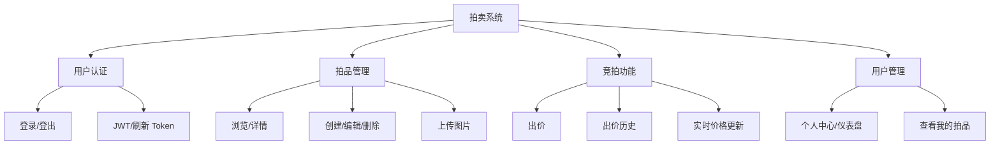

# 系统功能模块图

```mermaid
flowchart TB
  System[拍卖系统]

  System --> Auth[用户认证]
  System --> Item[拍品管理]
  System --> Bid[竞拍功能]
  System --> User[用户管理]

  Auth --> Login[登录/登出]
  Auth --> Token[JWT/刷新 Token]

  Item --> Browse[浏览/详情]
  Item --> Maintain[创建/编辑/删除]
  Item --> Upload[上传图片]

  Bid --> Place[出价]
  Bid --> History[出价历史]
  Bid --> Realtime[实时价格更新]

  User --> Profile[个人中心/仪表盘]
  User --> MyItems[查看我的拍品]
```
